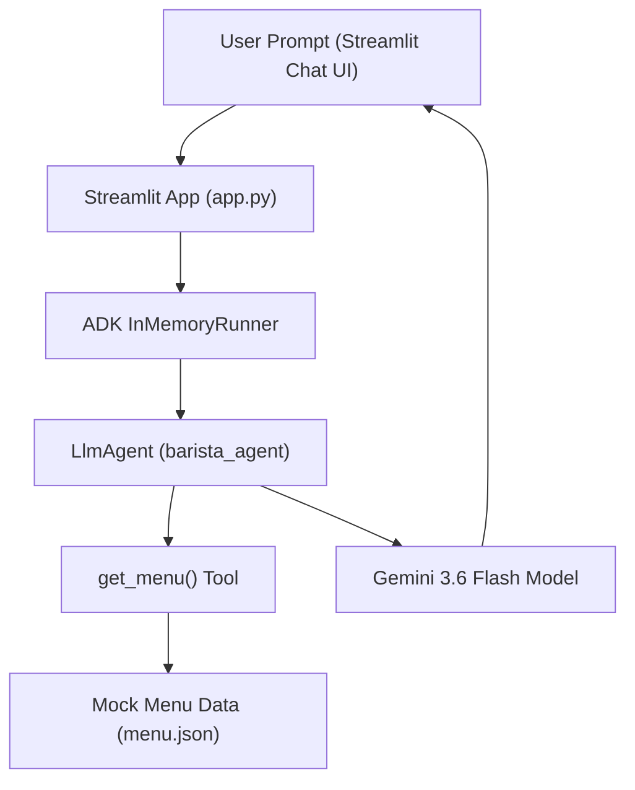

# Deploy a RAG AI Agent in Streamlit using Google ADK and Antigravity

This repository implements an interactive RAG (Retrieval-Augmented Generation) Coffee Barista AI Agent using Google's **Agent Development Kit (ADK 2.x)**, **Gemini API**, and a **Streamlit** user interface running locally in Antigravity.

---

## 🏗️ Architecture Overview



- **Data Grounding (`menu.json`)**: Contains coffee items, descriptions, prices, tags, and allergen information.
- **ADK Agent (`agent.py`)**: Defines `barista_agent` (`LlmAgent`) and attaches `get_menu()` tool to retrieve menu items dynamically.
- **UI (`app.py`)**: Built with Streamlit featuring a sticky header, interactive sidebar displaying menu badges/allergens, and chat history managed via `st.session_state`.
- **Skill Specification (`skills/rag-barista-advisor/SKILL.md`)**: Operational guidelines for allergen safety and single clarifying questions.

---

## 📁 Repository Structure

```text
Deploy a RAG AI Agent in Streamlit using Google ADK and Antigravity/
├── menu.json                          # RAG menu dataset (drinks, pastries, tags, allergens)
├── agent.py                           # Google ADK LlmAgent & get_menu() tool
├── app.py                             # Streamlit chat interface & sidebar menu
├── .env                               # API key configuration (GOOGLE_API_KEY, MODEL)
├── requirements.txt                   # Python dependencies (google-adk, streamlit)
├── README.md                          # Project documentation
├── scripts/
│   └── run_local.sh                   # Helper script to create venv & start Streamlit app
└── skills/
    └── rag-barista-advisor/
        └── SKILL.md                   # Custom Agent Skill for Barista RAG
```

---

## 🚀 Getting Started

### 1. Set Up Virtual Environment & Dependencies
```bash
python3 -m venv .venv
source .venv/bin/activate
pip install -r requirements.txt
```

### 2. Configure Environment Variables (`.env`)
```dotenv
GOOGLE_GENAI_USE_VERTEXAI=FALSE
GOOGLE_API_KEY=your_google_ai_studio_api_key
MODEL=gemini-3.6-flash
```

### 3. Launch Streamlit Application
Run using Python:
```bash
streamlit run app.py
```
Or using the helper script:
```bash
./scripts/run_local.sh
```

Open your browser to: **`http://localhost:8501`**

---

## 🧪 Testing RAG Grounding & Allergen Safety

Try these sample prompts in the Streamlit chat interface:

1. **Dairy-Free Recommendation**:
   > *"What dairy-free lattes or pastries do you have?"*
   - *Expected Result*: Agent recommends `Oat Milk Honey Latte` and `Vegan Blueberry Muffin` (skipping items with dairy allergens).

2. **Off-Menu Grounding Test**:
   > *"Can I get a Matcha Green Tea Latte?"*
   - *Expected Result*: Agent respectfully informs you that Matcha Green Tea Latte is not on the menu and suggests valid menu alternatives.

3. **Vague Preference Clarification**:
   > *"I want something cold."*
   - *Expected Result*: Agent asks one friendly clarifying question (e.g. whether you prefer a strong cold brew or a sweet caramel macchiato).

---

## ☁️ Optional Cloud Run Deployment

To deploy this application to Google Cloud Run for public web hosting:

```bash
# 1. Set project ID
export PROJECT_ID=your_gcp_project_id
gcloud config set project "$PROJECT_ID"

# 2. Deploy from source
gcloud run deploy barista-agent \
  --source . \
  --region us-central1 \
  --allow-unauthenticated \
  --set-env-vars GOOGLE_GENAI_USE_VERTEXAI=FALSE,GOOGLE_API_KEY=your_api_key,MODEL=gemini-3.6-flash
```
